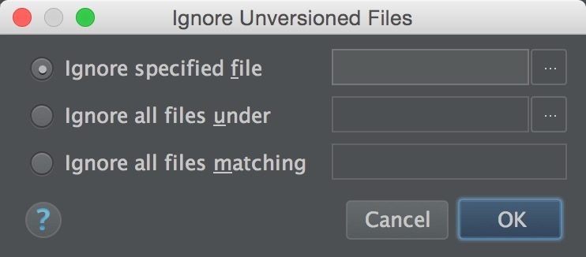

#android studio
##添加svn忽略文件

####通过文件右键添加忽略(仅在文件没有加入svn版本控制前)

####通过AS设置添加

+ 在设置中找到ignored file配置

+ 点击设置里面的+号后，可以弹出新增忽略窗口

  + 指定单个文件
  + 指定目录下所有(可用相对于项目的相对路径)
  + 正则匹配所有文件

###文件已经在svn控制内
####依然可以使用[AS设置方式添加](#ignore_by_setting)
